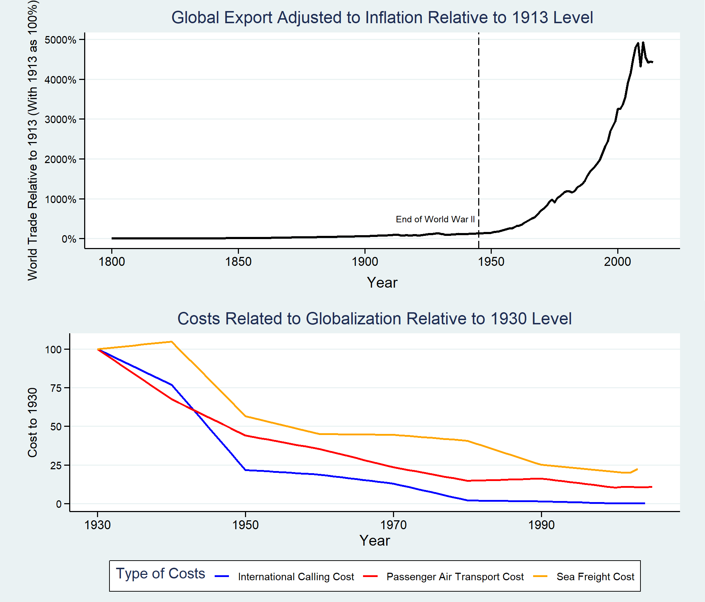
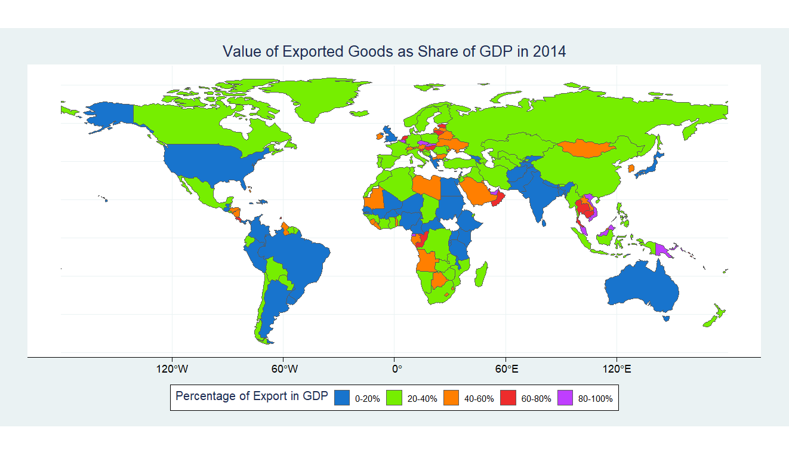

# Final Project

As shown by the plot above, the global export level started to take off after the end of World War II. Thanks to the growth of aviation and telecommunications technologies as well as reductions in the cost of sea freight, people across the world started to trade. Economics offers a great explanation for this phenomenon: although countries vary in their stages of development, they always have comparative advantages in the production of certain types of goods, and they can expand their production possibility frontier by trading. Furthermore, specialization can further drive down the cost of production. However, due to the pandemic and growing tension between China and the U.S., we are seeing a slowdown in this trend. As globalization comes under question and calls for decoupling start, we face some urgent questions. By writing this blog, I hope to address some of those issues. First, I want to discuss the relationship between export and economic growth. Second, I hope to address the validity of claims like globalization reduces income equality by reducing the need for domestic labor. Lastly, I will look at some factors that can help us predict the future of globalization.

To understand the impact of trade on economics, we can look at the map displaying the values of exported goods as shares of GDP. It is clear that for most countries, trade is an important part of their gross domestic product. For energy exporters like the UAE, Saudi Arabia, and Kuwait, trade is a crucial contributor to their prosperity. However, the real examples of benefactors in globalization are Southeast Asia countries like Thailand, Cambodia, and Vietnam. Due to their relatively low labor cost, they attracted foreign investments for their manufacturing industry, which in term led to economic growth and lifted people out of poverty. Despite not being shown in this plot, China's export once took up to 43.2% of its GDP. Similarly, the economy of Czechia and Slovakia relies heavily on exporting cars and machinery. By providing access to a market much greater than their domestic one, globalization has facilitated the development of those countries.

The plot above presents this relationship more clearly. As the countries' merchandise export start to take up greater portions of their GDP, their GDP per capita is also increasing. Therefore, we can see that by allowing the developed countries to invest in the developing world and all the countries to specialize, globalization has directly contributed to economic growth in the past half-century.

[Click Here to Return to Homepage](README.md)
