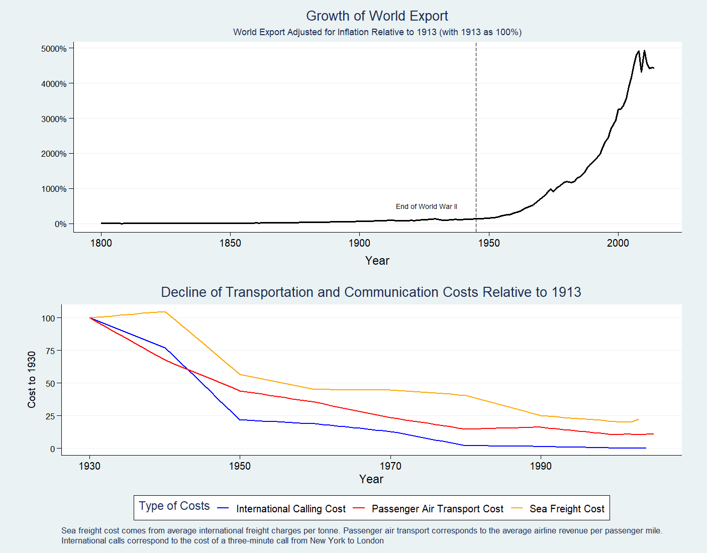
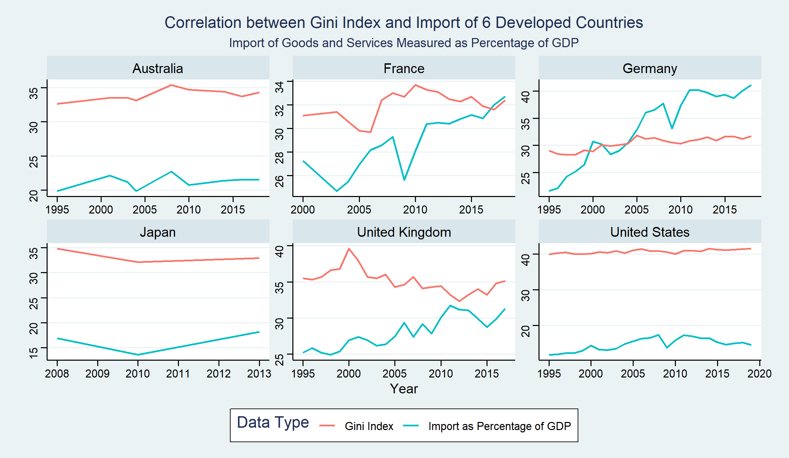
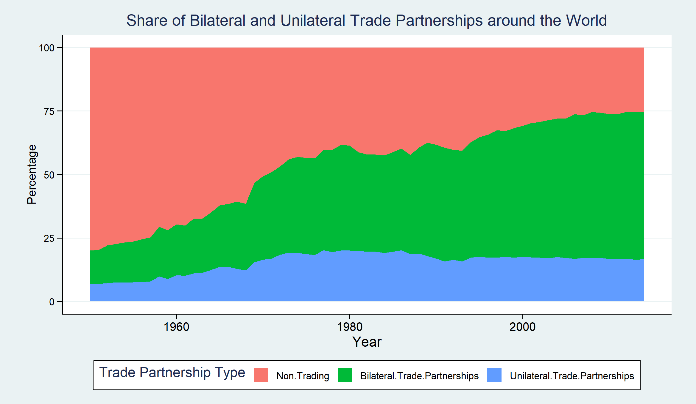
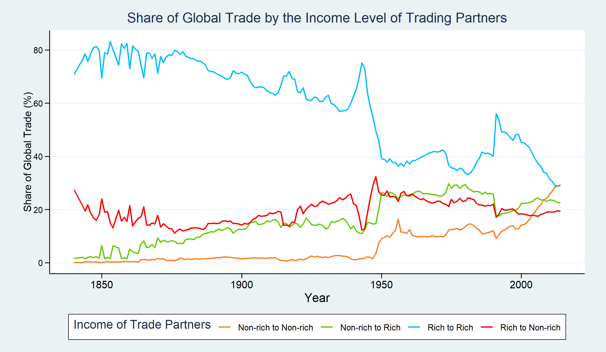

# Final Project - Globalization and Trade

As shown by the plot above [3], the global export level started to take off after the end of World War II. Thanks to the growth of aviation and telecommunications technologies as well as reductions in the cost of sea freight, people across the world started to trade. Economics offers a great explanation for this phenomenon: although countries vary in their stages of development, they always have comparative advantages in the production of certain types of goods, and they can expand their production possibility frontier by trading. Furthermore, specialization can further drive down the cost of production. However, due to the pandemic and growing tension between China and the U.S., we are seeing a slowdown in this trend. As globalization comes under question and calls for decoupling start, we face some urgent questions. By writing this blog, I hope to address some of those issues. First, I want to discuss the relationship between export and economic growth. Second, I hope to address the validity of claims like globalization reduces income equality by reducing the need for domestic labor. Lastly, I will look at some factors that can help us predict the future of globalization.

To understand the impact of trade on economics, we can look at the map displaying the values of exported goods as shares of GDP [3]. It is clear that for most countries, trade is an important part of their gross domestic product. For energy exporters like the UAE, Saudi Arabia, and Kuwait, trade is a crucial contributor to their prosperity. However, the real examples of benefactors in globalization are Southeast Asia countries like Thailand, Cambodia, and Vietnam. Due to their relatively low labor cost, they attracted foreign investments for their manufacturing industry, which in term led to economic growth and lifted people out of poverty. Despite not being shown in this plot, China's export once took up to 43.2% of its GDP. Similarly, the economy of Czechia and Slovakia relies heavily on exporting cars and machinery. By providing access to a market much greater than their domestic one, globalization has facilitated the development of those countries.

The plot above presents this relationship more clearly. As the countries' merchandise export start to take up greater portions of their GDP [3], their GDP per capita is also increasing. It is interesting to see that around the Great Recession in 2008, both GDP per capita and export percentage decreased. Therefore, we can see that by allowing the developed countries to invest in the developing world and all the countries to specialize, globalization has directly contributed to economic growth in the past half-century.

Then we will try to answer the question of whether relying on cheap foreign labor led to a greater wealth gap in developed countries by eliminating jobs and forcing workers to take lower salaries. In the paper "The China syndrome: Local labor market effects of import competition in the United States" [2], the author pointed out that exposure to Chinese competition led to reduce wage and unemployment in local labor market. However, others argue that the competition encouraged US companies to adapt, which brings new jobs elsewhere in the country [7]. I will try to take a more wholistic view here. The measurement of inequality I have chosen here is the Gini index [5]. The import as a percentage of GDP should be proportional to the impact of globalization on domestic manufacturing [6]. As shown by the plot above, the Gini indices of the selected countries remain largely unchanged in the time period, despite countries like France and Germany having increasingly higher levels of import. A plausible explanation is that while globalization reduces the number of manufacturing jobs in those countries, it provides new opportunities in other industries. By encouraging workers to pursue jobs with higher skill requirements and wages, globalization can potentially have a positive impact on the distribution of income in a country.

Although the claims against globalization were poorly established, they did not prevent the Trump administration from starting a trade war with China. As seen by the plot above [1], after the start of the trade war, both sides raised the tariff on each other's exports significantly, especially when compared to the level they set for the rest of the world. As a result, US's export and import with China both started to drop. This decline sent a shockwave across the globe, threatening the world economy already on the verge of recession. As a result, many people started to question if the era of globalization is coming to an end.

However, there are some encouraging signs. Despite the higher tariff between US and China, their trade volume started to recover, showing their need for each other [4]. Furthermore, as shown above, the number of bilateral trading partnerships is steadily increasing, and the number of non-trading countries is decreasing. While the voice is decoupling is loud, there is strong evidence supporting the strength of globalization.

Furthermore, trading between countries in the global south is gradually increasing. As those countries are less likely to engage in competitions like the current one between the US and China, we should expect fewer disturbances. Additionally, as countries like China lead the way in supplying developing countries with affordable clothing, electronics, and technologies, we should expect globalization to serve as a driving force for economic development and improvement of living standards.

## Sources

[1] (PIIE), Chad P. Bown. “US-China Trade War Tariffs: An up-to-Date Chart.” PIIE, 29 Aug. 2022, https://www.piie.com/research/piie-charts/us-china-trade-war-tariffs-date-chart.

[2] Autor, David H, et al. “The China Syndrome: Local Labor Market Effects of Import Competition in the United States.” American Economic Association, https://pubs.aeaweb.org/doi/pdfplus/10.1257/aer.103.6.2121.

[3] Beltekian, Esteban Ortiz-Ospina and Diana. “Trade and Globalization.” Our World in Data, https://ourworldindata.org/trade-and-globalization.

[4] Bureau, US Census. “International Trade.” United States Census Bureau, 15 Apr. 2019, https://www.census.gov/foreign-trade/balance/c5700.html.

[5] “Gini Index.” The World Bank, https://data.worldbank.org/indicator/SI.POV.GINI.

[6] “Imports of Goods and Services (% of GDP).” The World Bank, https://data.worldbank.org/indicator/NE.IMP.GNFS.ZS.

[7] Magyari, Ildikó. “Firm Reorganization, Chinese Imports, and US Manufacturing Employment.” Columbia University in the City of New York, http://www.columbia.edu/~im2348/JMP_Magyari.pdf.

[Click Here to View Package References](References/Final_Project.pdf)

[Click Here to Return to Homepage](README.md)
