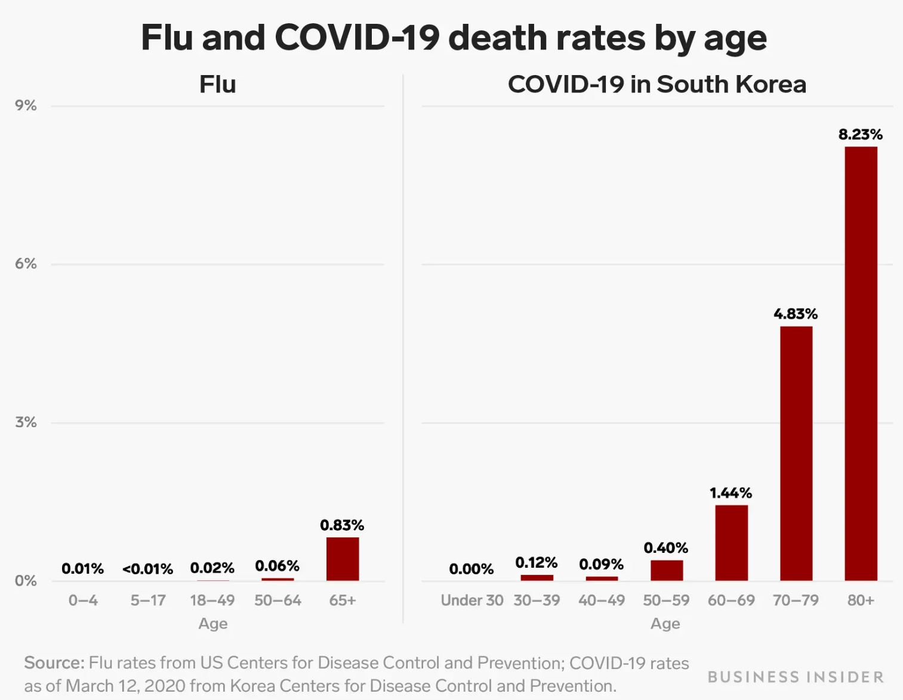

# Short Form Blogs 1

## Bad Visualization

The writer used this plot to support his claim that COVID-19 is more dangerous than flu in South Korea, a country with relatively low COVID death rates. However, the comparison between the death rates of flu in the US and COVID in South Korea is flawed due to the failure to control variables. If the US is good at protecting its people against deaths caused by flu, this graph will not back the writer’s message. At the same time, the plot offers little information about how the COVID death rate in Korea compares to that in other countries. The writer needs to consider the type and source of information used in his article.

## References

Kiersz, Andy. “One Chart Shows How the Coronavirus Is More Deadly than the Flu Even in South Korea, Where the Covid-19 Death Rate Is Low.” Business Insider, Business Insider, https://www.businessinsider.com/coronavirus-death-rate-south-korea-compared-to-flu-2020-3. 

Lund, Susan, et al. “The Future of Work after COVID-19.” McKinsey & Company, McKinsey & Company, 2 Aug. 2022, https://www.mckinsey.com/featured-insights/future-of-work/the-future-of-work-after-covid-19. 

[Click Here to Return to Homepage](README.md)
