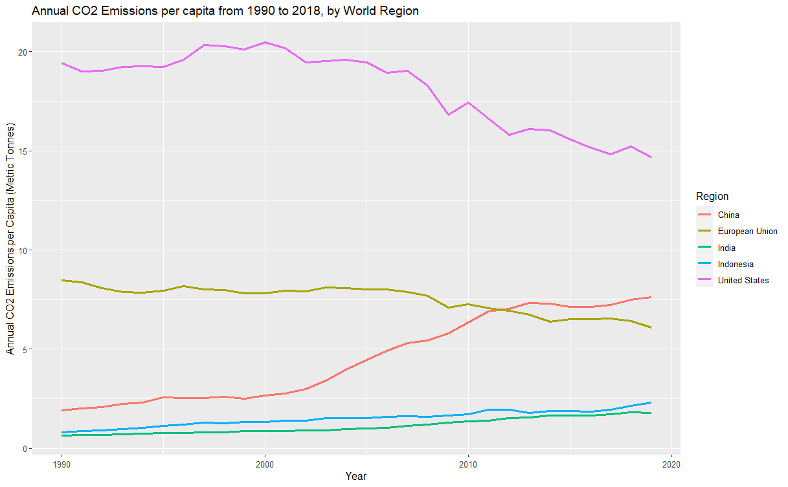

# Short Form Blogs 1

After U.S. House of Representatives Speaker Nancy Pelosi's controversial trip to Taiwan, China suspended talks on climate cooperation with the U.S. This action again drew the attention of countries around the world as the U.S. and China are two of the biggest emitters of greenhouse gas emissions. Indeed, climate change has always been a topic of debate. In this blog, I want to discuss some possible ways to view the responsibilities of countries in combating climate change. And as a result, how to distribute the burden across the world. Then, with some data on key factors affecting greenhouse gas emissions like oil consumption, renewable energy utilization, and electric vehicle technology, I hope to get a better idea of how the situation might evolve in the coming years.

The first plot above was made with data from the Global Carbon Project. It shows the change in annual emissions of the United States, EU countries, Europe Non-EU countries, China, and India. It represents a mix of developing and developed countries. Note that while there are many approaches for drawing the line between those two categories, I will use GDP per capita as it is popular and widely accepted. For countries with a GDP per capita greater than 20,000 dollars, I categorize them as developed and vice versa. Based on the graph, we can see that while the emissions of the developed regions have leveled off and even started to decrease, the emissions of China and India started to increase rapidly. Trends like these have drawn criticism from developed nations.

In response, developing countries claim that this is not fair for them. In order to provide better living standards for their people, they need to industrialize, which requires more fossil fuel than agriculture. Additionally, a more comfortable lifestyle will require more energy consumption. This trend is especially prominent in China. As shown by the plot above, the carbon dioxide emission per capita growth kept pace with that of the GDP per capita. They argue that the developed countries have already created greenhouse gas in their industrialization process and have no right to judge them. Indeed, if we change how we view the data and sum up the emission from 1750 to 2020, we can see that the developed regions have released much more CO2. As someone coming from the developing world, I believe it would be unfair if the burden to combat climate change falls more on countries like China given many of their citizens still live in poverty.

A good policy should be guided by pollution per capita while keeping inequalities in mind. From the plot above, we can see that while China's emission per capita is increasing, it is still comparable to the EU countries and significantly lower than that of the United States. Similarly, while its GDP per capita has grown a lot, there is still a considerable gap between China and the US. The gap for India is even greater in both respects. Therefore, a more advisable strategy is to encourage the developing world to adopt more green technologies during its growth to curb the increasing greenhouse gas emission.

[Click Here to Return to Homepage](README.md)
