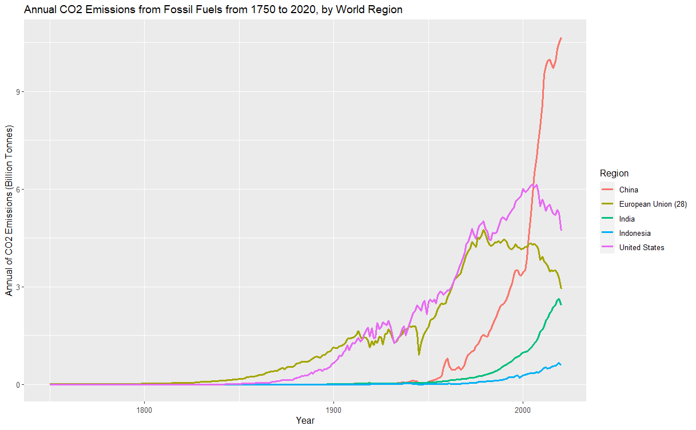
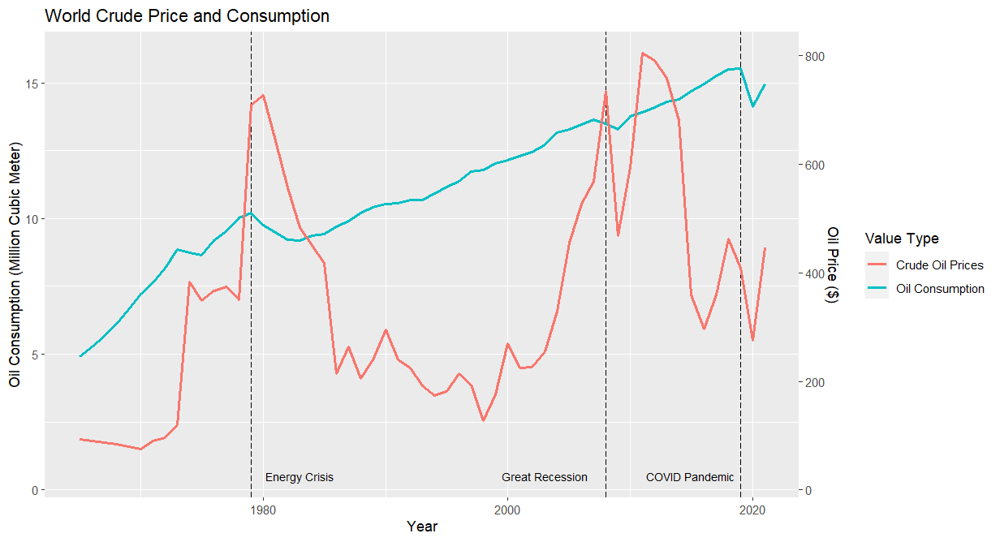
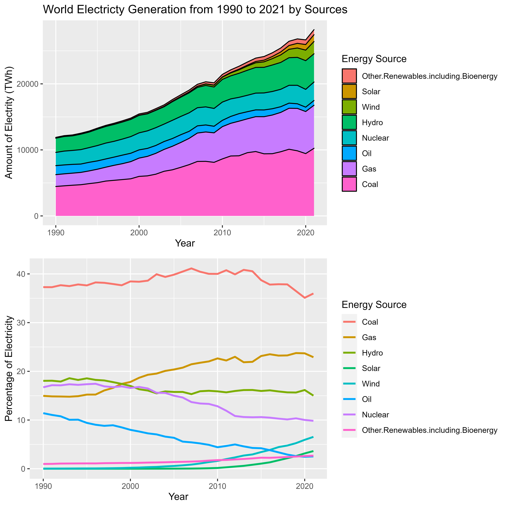
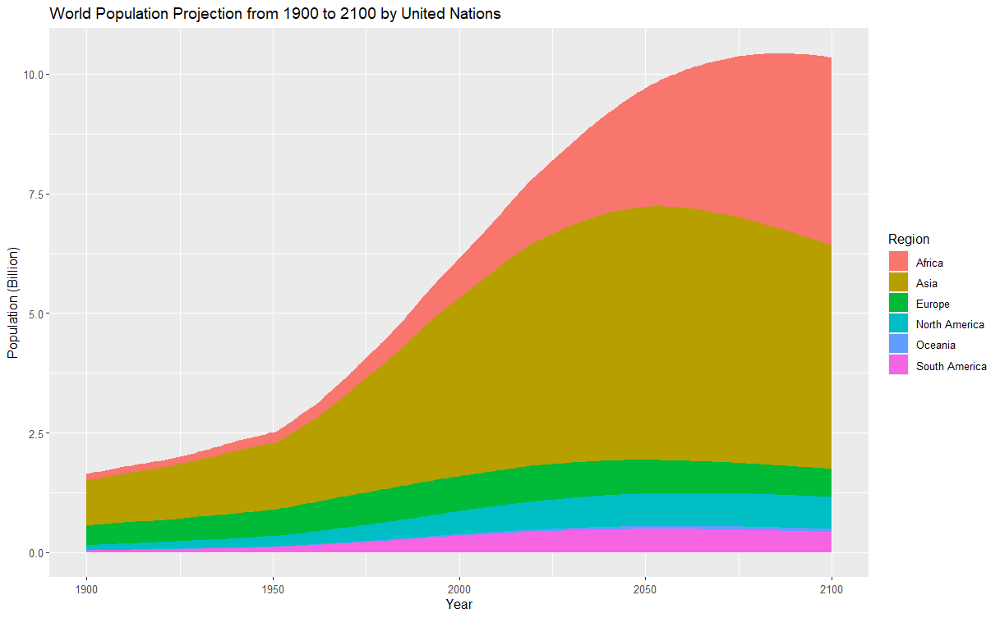

# Short Form Blogs 1

After U.S. House of Representatives Speaker Nancy Pelosi's controversial trip to Taiwan, China suspended talks on climate cooperation with the U.S. This action again drew the attention of countries around the world as the U.S. and China are two of the biggest emitters of greenhouse gas emissions. Indeed, climate change has always been a topic of debate. In this blog, I want to discuss some possible ways to view the responsibilities of countries in combating climate change. And as a result, how to distribute the burden across the world. Then, I will talk about some relevant factors and how they might affect our effort to combat climate change based on what the EPA reports as the main contributors to greenhouse gas emissions. Specifically, that includes transportation, electricity generation, agriculture, and industry. I will detail the trends that might influence each of them to identify challenges and opportunities.

### Distribution of Burden

The first plot above was made with data from the Global Carbon Project. It shows the change in annual emissions of the United States, European Union countries, China, Indonesia, and India. It represents a mix of developing and developed countries. Note that while there are many approaches for drawing the line between those two categories, I will use GDP per capita as it is popular and widely accepted. For countries with a GDP per capita greater than 20,000 dollars, I categorize them as developed and vice versa. Based on the graph, we can see that while the emissions of the developed regions have leveled off and even started to decrease, the emissions of China and India started to increase rapidly. Trends like these have drawn criticism from developed nations.

In response, developing countries claim that this is not fair for them. In order to provide better living standards for their people, they need to industrialize, which requires more fossil fuel than agriculture. Additionally, a more comfortable lifestyle will require more energy consumption. This trend is especially in the first plot above. We can see that higher GDP per capita usually means higher emissions per capita. As developing nations grow economically, their emissions per capita also increases. They argue that the developed countries have already created greenhouse gas in their industrialization process and have no right to judge them. Indeed, if we change how we view the data and sum up the emission from 1750 to 2020, we can see that the developed regions have released much more CO2. As someone coming from the developing world, I believe it would be unfair if the burden to combat climate change falls more on countries like China given many of their citizens still live in poverty.

A good policy should be guided by pollution per capita while keeping inequalities in mind. From the plot above, we can see that while China's emission per capita is increasing, it is still comparable to the EU countries and significantly lower than that of the United States. Similarly, while its GDP per capita has grown a lot, there is still a considerable gap between China and the US. The gap for India is even greater in both respects. Therefore, a more advisable strategy is to encourage the developing world to adopt more green technologies during its growth to curb the increasing greenhouse gas emission.

### Transportation

Next, I will discuss some factors that might affect our greenhouse gas emissions. Based on the EPA, transportation accounts for 14% of our greenhouse gas emissions. Furthermore, more than 90% of the fuel used is petroleum based. I created a plot of crude oil prices and oil consumption. As shown in the plot, the long-term impact of oil prices on oil demand is relatively small. Despite the fluctuations, the overall upward trend of oil demand remained unchanged. However, it is noticeable that around 1979, 2008, and 2019, oil consumption took a hit. These events relate to economic recessions rather than oil price changes. Therefore, I predict that while the price hike caused by the war in Ukraine is unlikely to alter global demand, a recession caused by soaring inflation might do the job. We should expect to see the post-pandemic surge in oil usage ease in the coming months, and this could be a positive sign for the effort to curb global warming.

### Electricity Generation

Another important source of greenhouse gas emission is electricity generation, which, according to the EPA, accounts for 25% of the greenhouse produced by the world. Recently, there are some promising developments. According to the first plot above, a significant portion of electricity comes from zero-emission sources like nuclear, hydro, and wind. The second plot also shows that renewable energy including wind and solar is trending up, whereas the use of coal is decreasing. Furthermore, if the rapid developments of EV technologies allow us to rely less on fossil fuels and replace them with renewable energy, this could lead to significant emission reduction. Despite that, we should pay attention to the fact that our electricity usage is still increasing and ensure that we are not wasting energy and use cleaner sources when building power plants. It is also important to note that if Republicans take back the Senate and House in the midterm or the White House in 2024, they might slow down the transition to green energy due to their conservative views on this issue. If the US shifts its policy, its prominent role on the world stage might affect other countries' decisions as well.

### Agriculture and Industry

A final key predictor of greenhouse gas emissions are agriculture and industry, which takes up 24% and 21% of global emissions. Since we do not have enough space to explore those two areas in detail, I will use population to guide the analysis. By predicting the trend and distribution of population, we can gain insights into how our greenhouse gas emissions will change. From the plot above, we see that the global population has been steadily increasing during the past century, matching the growth in energy demand we saw before. Since the population is not expected to level off until 2100, we will continue to face challenges in controlling the increase in greenhouse gas emissions. However, after 2025, the growth will start to slow down. Another important pattern is that Asia and Africa accounts for most of the change, which means the developing countries are driving the increase. It is a relief since those countries typically have less CO2 emission per capita. Overall, the trend in population means we need to put more effort into fighting climate change.

### Summary

In summary, this blog explores some important questions regarding climate change. First, I believe while developing countries' emissions are increasing, it does not mean they should bear the burden alone. To reduce the gap between developing and developed countries, we should use emissions per capita to guide us. Furthermore, I also talk about how transportation, electricity generation, and agriculture and industry affect the global emissions level. Overall, we still face some challenges from population growth. However, the possibility of a recession and transition to green energy should alleviate the pressure in the short term. In the long term, we should continue to invest in renewable energy to combat climate change.

There are two main sources of data used in this blog. The World Bank is a well-known and authoritative source of data. Our world in data is supported by Global Changes Data Lab, a non-profit based in the UK. It works with Oxford University to gather and share data. Therefore, it should also be considered reliable. Additionally, I also cited some data from the EPA, which is a good source for energy-related issues.

There are some limitations in the data I use. For example, it is unclear how they arrived at CO2 emissions numbers given that it is not feasible to measure emissions at every possible source. Furthermore, the population dataset contains projections up to 2100. It would be nice to see the models used there. Additionally, there are some problems data does not show. I cannot show how the lower GDP per capita of China and India relate to the living standards of their people. There could be better sources for making that point.

Similarly, the visualizations have some room for improvement. For the GDP and CO2 emissions per capita plot, since developing nations usually have lower GDP and emissions per capita, their points overlap with each other and their names are sometimes hidden. There might be better ways to present the region names. For the total emission from the 1750 to 2020 plot, I think it has room for more information, but I could not come up with something concrete to add. In the percentage of energy consumption plot, the lower part of the plot gets too crowded due to a large number of energy sources in that range. It would be nice to spread them out. Lastly, if the population plot gets separated into specific countries, it might help to make my point that developing countries are the main contributor clearer. However, there is also the risk of making too many layers and hurting the overall delivery. After weighing the cost and benefits, I decided to use the current version.

## Data sources

Total CO2 Emission by Region:
https://ourworldindata.org/co2-emissions

CO2 Emission per capita Data:
https://data.worldbank.org/indicator/EN.ATM.CO2E.PC

GDP per capita Data:
https://data.worldbank.org/indicator/NY.GDP.PCAP.CD

Oil Price and Consumption Data:
https://ourworldindata.org/grapher/world-crude-oil-price-vs-oil-consumption

Electricity by Sources Data:
https://ourworldindata.org/electricity-mix

Population Data:
https://ourworldindata.org/world-population-growth

Global Greenhouse Gas Emissions Data:
https://www.epa.gov/ghgemissions/global-greenhouse-gas-emissions-data

[Click Here to Return to Homepage](README.md)
