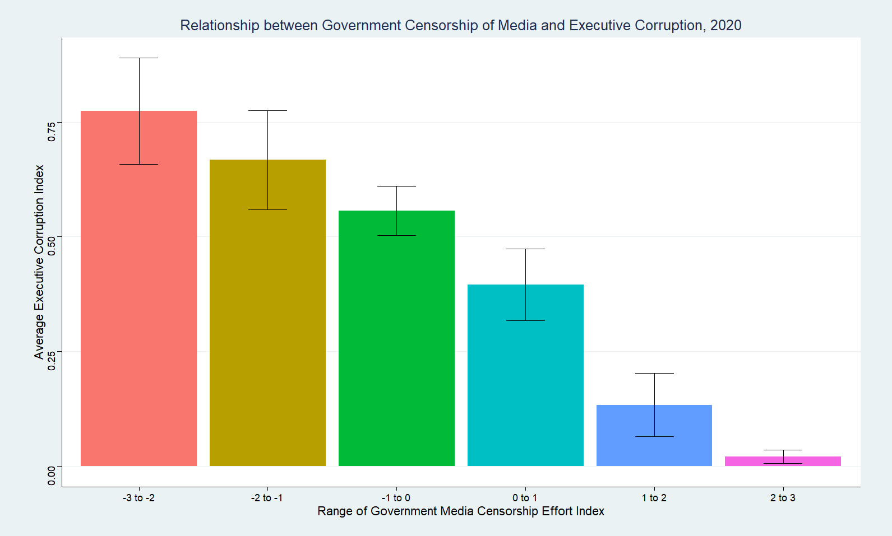
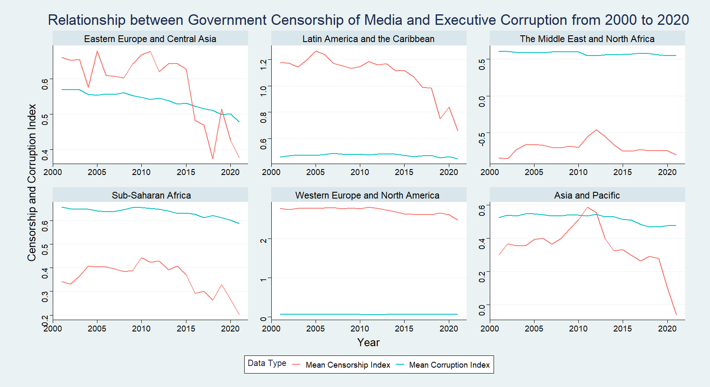
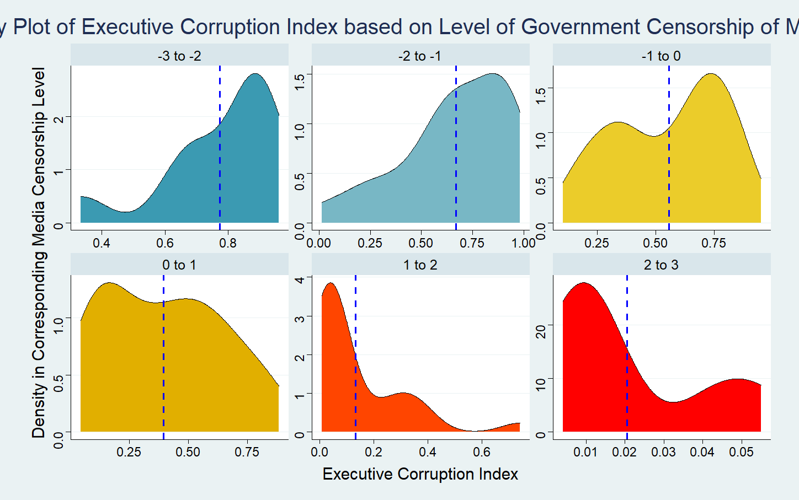

# Short Form Blogs 2

In this blog, I want to investigate the relationship between government censorship of media and regime corruption. In particular, I hope to see if the absence of censorship allows the media to play a role in overseeing the government. The measurement of corruption I have chosen is the political corruption index (v2x_execorr). It captures how routinely executive members grant favors in exchange for bribes and how often they steal public funds for personal use. The measurement of government censorship I used is the government censorship effort - Media index (v2mecenefm). It reflects the answer to the question "does the government directly or indirectly attempt to censor the print or broadcast media". These ratings come from surveys of country experts as well as data gathered by V-Dem members and coordinators from other sources. While they claim that their sources are reliable, I think they should try to use more objective sources like the presence of laws for censoring media or the amount of money involved in corruption cases to avoid biases and human errors.

This plot provides a snapshot of the level of media censorship and corruption in countries grouped by their geographic regions. We can see that in most cases, having a lower level of media censorship leads to less corruption. This trend is especially prominent for countries in Europe and North America. However, there are a few special cases like Singapore and China, where the level of corruption is relatively low despite government censorship.

We can also group the countries based on their government censorship levels. In this plot, we can see an even clearer trend that countries with fewer media censorship also have less corruption. However, the significantly lower corruption index for the countries with media censorship indices above 2 also suggests an alternative explanation. Since that category contains mainly wealthy European countries, the higher living standard could discourage corruption.

This plot reveals some interesting trends. Contrary to the previous plots, the trend seems to be reversed across the time period, with the average level of censorship increasing and corruption decreasing. However, I believe the overall conclusion remains valid. Given the increasing amount of misinformation faced by all governments, we should expect more censorship. It is encouraging to see the increase in censorship did not prevent the decline in corruption across this period worldwide.

While the second plot gives us an idea about the average corruption index in each bin, it does not show the distribution of indices. The density plot above shows how closely the corruption indices cluster around the mean, which allows us to evaluate if we can use media censorship as a predictor of corruption. In this case, we can say that when the level of censorship is relatively high, we can reliably predict a low level of corruption. Furthermore, the blue dotted line showing the average corruption level still presents an overall negative correlation between those two indices.

[Click Here to Return to Homepage](README.md)
