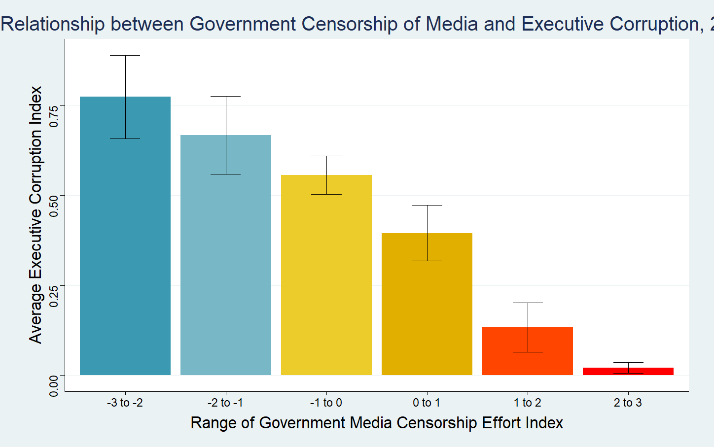

# Short Form Blogs 2

In this blog, I want to investigate the relationship between government censorship of media and regime corruption. In particular, I hope to see if the absence of censorship allows the media to play a role in overseeing the government. The measurement of corruption I have chosen is the political corruption index (v2x_execorr). It captures how routinely executive members grant favors in exchange for bribes and how often they steal public funds for personal use. The measurement of government censorship I used is the government censorship effort - Media index (v2mecenefm). It reflects the answer to the question "does the government directly or indirectly attempt to censor the print or broadcast media". These ratings come from surveys of country experts as well as data gathered by V-Dem members and coordinators from other sources. While they claim that their sources are reliable, I think they should try to use more objective sources like the presence of laws for censoring media or the amount of money involved in corruption cases to avoid biases and human errors.

This plot provides a snapshot of the level of media censorship and corruption of countries grouped by their geographic regions. We can see that in most cases, having lower level of media censorship leads to lower corruption. 

[Click Here to Return to Homepage](README.md)
