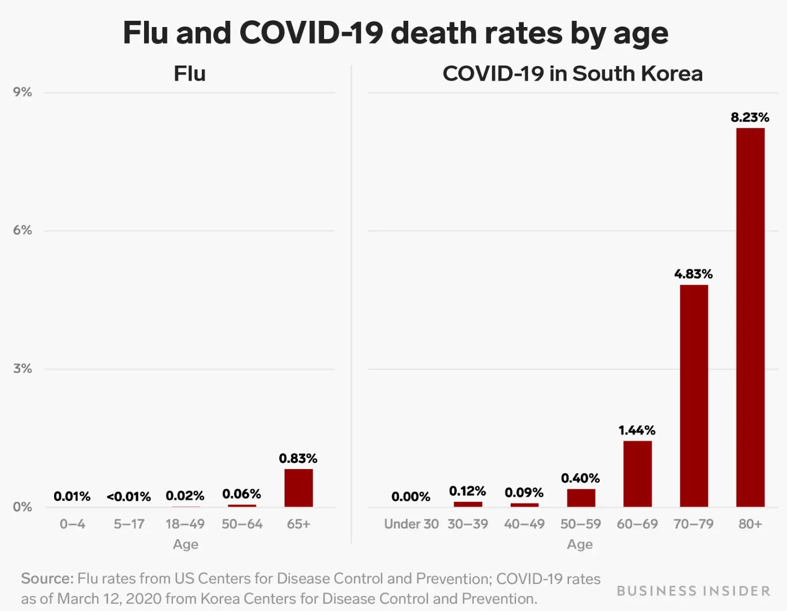
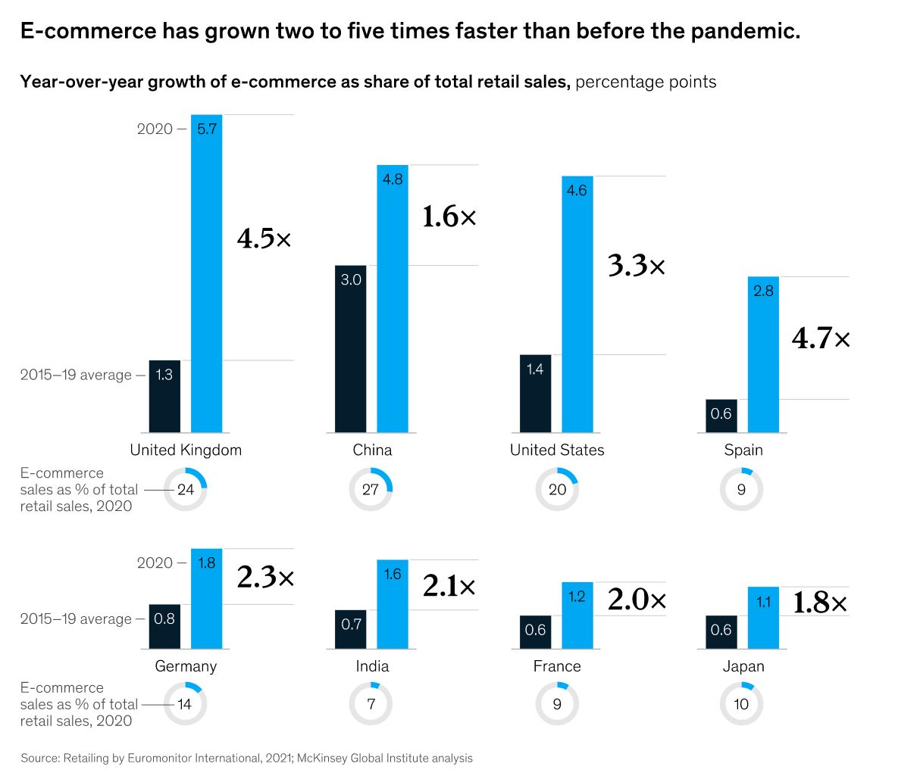
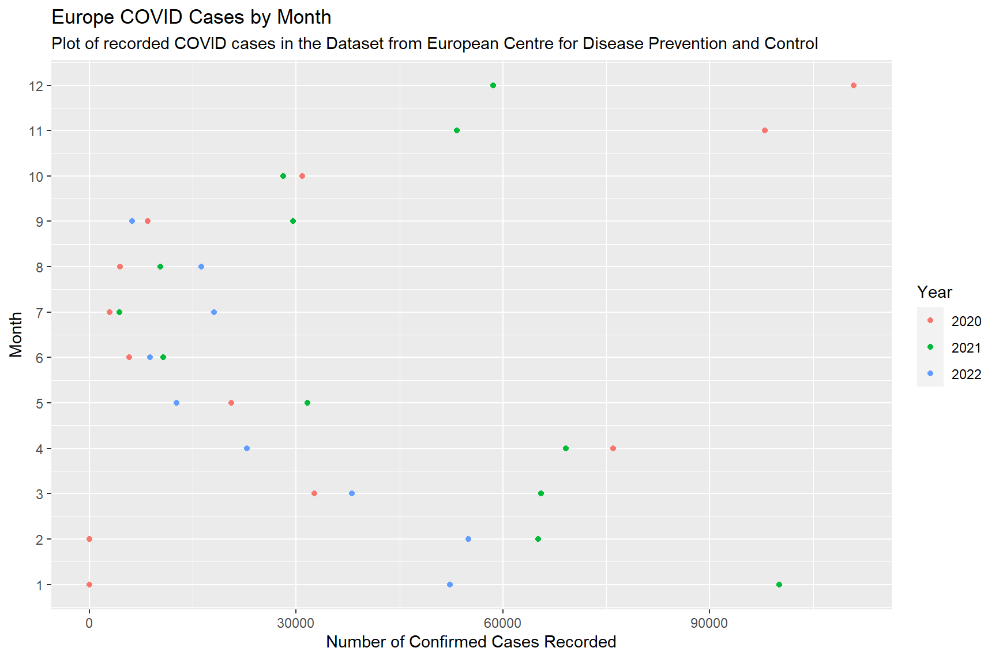

# Visualization Blog 1

## Bad Visualization

<p align="center">

</p>

The writer used this plot to support his claim that COVID-19 is more dangerous than flu in South Korea, a country with relatively low COVID death rates. However, the comparison between the death rates of flu in the US and COVID in South Korea is flawed due to the failure to control variables. If the US is good at protecting its people against deaths caused by flu, this graph will not back the writer’s message. At the same time, the plot offers little information about how the COVID death rate in Korea compares to that in other countries. The writer needs to consider the type and source of information used in his article. It would be nice to compare flu and COVID death rates in Korea. There should also be a separate plot showing the death rate of COVID in a range of countries to show that Korea is good at controlling COVID.

## Good Visualization

<p align="center">

</p>

This plot from McKinsey is a good example. First, to show the widespread growth of e-commerce, it uses a range of developed and developing countries. It also directly presents how the previous growth rate compares to the 2020 value, which is helpful because it highlights the main point and avoids bar charts' weakness in illustrating relative size. Additionally, the writers anticipated that the readers might doubt the significance of the change in growth rate. Therefore, they included the percentage of e-commerce in total retail sales. Because those values are high in the countries selected, we know that the trend is valid.

### Replication Code

```R
rate <- c(rep("China" , 2) , rep("France" , 2) , rep("Japan" , 2) , rep("India" , 2) )
condition <- rep(c("previous" , "current") , 4)
value <- abs(rnorm(8,0))
mock <- data.frame(rate,condition,value)

mock %>% ggplot(aes(fill=condition, y=value, x=specie)) + 
  geom_bar(position="dodge", stat="identity")
```

## My Visualization

<p align="center">

</p>

This plot is made from the data published by European Center for Disease Prevention and Control. The dataset contains daily COVID cases for EU countries. I first grouped the data by month and year, then summed the number of infections. When creating the plot, I used color to distinguish between the three different years to account for incomplete months. By creating this plot, I hope to see if there is a seasonal pattern in the spread of COVID. From the figure, we see that when the weather is cold, the number of confirmed cases tends to be higher. This evidence supports the theory that increased indoor activity during winter leads to more confirmed cases.

## References

Kiersz, Andy. “One Chart Shows How the Coronavirus Is More Deadly than the Flu Even in South Korea, Where the Covid-19 Death Rate Is Low.” Business Insider, Business Insider, https://www.businessinsider.com/coronavirus-death-rate-south-korea-compared-to-flu-2020-3. 

Lund, Susan, et al. “The Future of Work after COVID-19.” McKinsey & Company, McKinsey & Company, 2 Aug. 2022, https://www.mckinsey.com/featured-insights/future-of-work/the-future-of-work-after-covid-19.

“Data on the Daily Number of New Reported COVID-19 Cases and Deaths by EU/EEA Country.” European Centre for Disease Prevention and Control, 3 Oct. 2022, https://www.ecdc.europa.eu/en/publications-data/data-daily-new-cases-covid-19-eueea-country. 

[Click Here to Return to Homepage](README.md)
