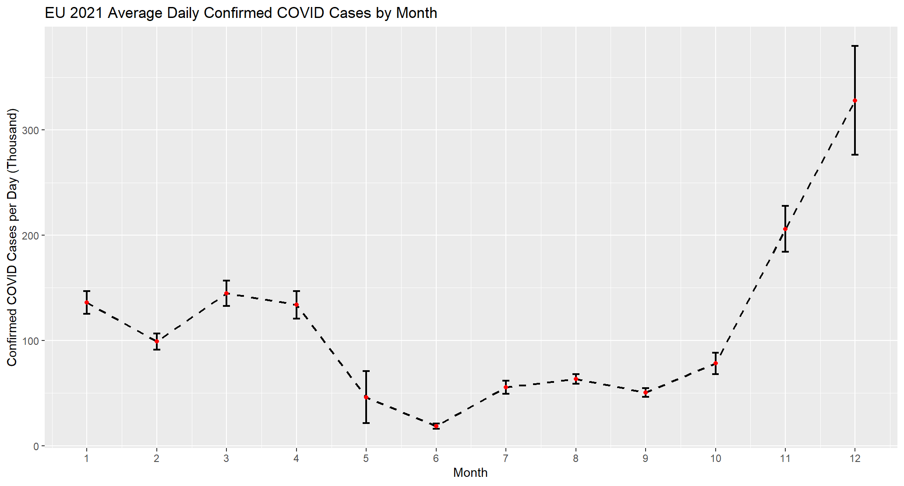
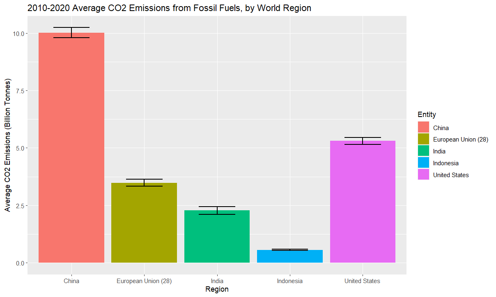

# Visualization Blog 2

## Accounting for Uncertainties in Data

```R
emission <- read.csv("annual-co-emissions-by-region.csv")
target <- c('Indonesia','India','China','European Union (28)','United States' )

emission %>% 
  group_by(Entity)%>%
  filter(all(Entity %in% target))%>%
  filter(Year>2010)%>%
  mutate(ems_val=Annual.CO2.emissions..zero.filled./10^9)->sum_ems_res
  #Find the emission in the given time period of the selected regions
  #Change the unit to billion tonnes

sum_ems_res %>%
  group_by(Entity) %>%
  summarise(mean_ems = mean(ems_val, na.rm = T), 
            se_ems = sd(ems_val, na.rm = T)/sqrt(10)) %>%
  #Calculate the mean and average for each country/region
  mutate(lower_bound = mean_ems - (se_ems*1.96), 
        upper_bound = mean_ems + (se_ems*1.96))-> sum_ems_res
  #Assume a 95% confidence, we can use the equation above to find confidence interval
```

<p align="center">

</p>

```R
sum_ems_res %>%
  ggplot(aes(Entity, mean_ems, fill = Entity)) +
  geom_bar(stat = "identity") + 
  labs(x="Region", y = "Average CO2 Emissions (Billion Tonnes)", 
       title="2010-2020 Average CO2 Emissions from Fossil Fuels, by World Region") +
  geom_errorbar(aes(ymin = lower_bound, ymax = upper_bound), width = 0.5,size=0.8)

data <- na.omit(read.csv("VisBlog1.csv"))
data %>% 
  group_by(year,month,day)%>%
  filter(year==2021)%>%
  summarise(total = sum(cases, na.rm = T))%>%
  mutate(total=total/1000)->cleaned
#Select the 2021 data and sum up the case counts for all EU countries

cleaned %>% 
  group_by(month)%>%
  summarise(sample_size = n(),
            #find the number of days in each month
            mean_cases=mean(total, na.rm = T),
            #find the average number of cases per day for every month
            se_cases = sd(total, na.rm = T)/sqrt(sample_size))%>%
            #find the standard error
  mutate(lower_bound = mean_cases - (se_cases*1.96), 
         upper_bound = mean_cases + (se_cases*1.96))-> cases_data
            #integrate the standard error by finding the upper and lower bound
```

<p align="center">

</p>

[Click Here to Return to Homepage](README.md)
